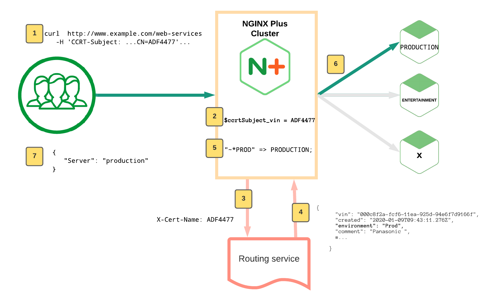

# NJS sub-request for routing decision

An NGINX Plus Docker demo for Demonstrating NJS sub-request for Routing Decision

## Mock Scenario

Connected cars are routed to the appropriate API service based on their unique identifier

## How it Works



We are using a mock routing service that has the routing response hardcoded. To
change the routing response, and we will need to change the associated config

There are also Mock services `Production`, `ENTERTAINMENT` and `X`, NGINX routes
to

1. Client Makes a request with a `CCRT-Subject` Header. There are various values
   in this header including the expected `CN`
2. NGINX process the request:
   1.  Check that the `CN` exists. If the `CN` is blank, NGINX responds with a
       `HTTP 400` error back to the client. 
   2. If `CN` value exists, NGINX will extract that value from the
      `CCRT-Subject` header and save it as the `$ccrtSubject_vin` NGINX variable
3. NGINX then make a sub-request using NGINX NJS to the routing service with
   that `CN` value (`$ccrtSubject_vin`) in the `X-Cert-Name` header i.e
   `X-Cert-Name: $ccrtSubject_vin`
4. The Routing Service responds with a JSON response, in this payload includes
   the "`environment`" value: `Prod`, `ENTERTAINMENT` , `X` or something else.
5.  NGINX NJS parses the JSON body from the Routing Service, extracts the
    `environment` value and sets the `$env` NGINX variable, e.g. `Production`
6.  NGINX maps the value of `$env` (`Production`) to the known upstream named
    `Prod`
7. Client gets the response from the routed service

### Commentary on NGINX Config

The NGINX Config uses a combination of
[auth_request](http://nginx.org/en/docs/http/ngx_http_auth_request_module.html)
and [NJS](https://nginx.org/en/docs/njs/) to execute a subrequest before a
request is passed to the backend

There is a workaround `location`, `/get_env_trampoline` to get around an NGINX
limitation (`Dec 2020`) which disallows to create a subrequest from a subrequest
(`auth_request` is a subrequest, and the subrequest in [`js_content`](http://nginx.org/en/docs/http/ngx_http_js_module.html#js_content) will fail),
instead we do a `proxy_pass` connection back to auxillary server


## File Structure

```
etc/
 ├── nginx/
 │    ├── conf.d/ # ADD your HTTP/S configurations here
 │    │   ├── vinrouter.conf......HTTP Virtual Server configuration
 │    │   ├── dummy_vin_servers_json.conf...Dummy loopback web servers responds with application/json
 │    │   ├── dummy_servers.conf............Dummy Upstream configurations: PRODUCTION, ENTERTAINMENT and "X"
 │    │   ├── health_checks.conf............Custom health check definitions
 │    │   └── status_api.conf................NGINX Plus Live Activity Monitoring available on port 8080 - [Source](https://gist.github.com/nginx-gists/│a51 11ff1cf4e94ac359b67f1c4ae)
 │    ├── includes
 │    │    ├── add_headers
 │    │    │   └── security.conf_ ....................Recommended response headers for security
 │    │    ├── proxy_headers
 │    │    │   └── load_balancing_algorithms.conf.....Recommended request headers for security and performance
 │    │    └── ssl
 │    │        ├── ssl_intermediate.conf.....Recommended SSL configuration for General-purpose servers with a variety of clients, recommended for almost all systems
 │    │        ├── ssl_a+_strong.conf........Recommended SSL configuration for Based on SSL Labs A+ (https://www.ssllabs.com/ssltest/)
 │    │        ├── ssl_modern.conf...........Recommended SSL configuration for Modern clients: TLS 1.3 and don't need backward compatibility
 │    │        └── ssl_old.conf..............Recommended SSL configuration for compatiblity ith a number of very old clients, and should be used only as a last resort
 │    ├── nginx.conf ...............Main NGINX configuration file with global settings
 |    └── api_json_errors.conf .....Custom API error reponses (used when proxy_intercept_errors on)
 |          
 └── ssl/
       ├── nginx/
       │   ├── nginx-repo.crt........NGINX Plus repository certificate file (**Use your own license**)
       │   └── nginx-repo.key........NGINX Plus repository key file (**Use your own license**)
       ├── dhparam_2048.pem..........Diffie-Hellman parameters for testing (2048 bit)
       ├── dhparam_4096.pem..........Diffie-Hellman parameters for testing (4096 bit)
       ├── example.com.crt...........Self-signed wildcard certifcate for testing (*.example.com)
       └── example.com.key...........Self-signed private key for testing
```

## Setup and Run Docker container

 1. Copy and paste your `nginx-repo.crt` and `nginx-repo.key` into
    `etc/ssl/nginx` directory

 2. Build an image from your Dockerfile:
    ```bash
    # Run command from the folder containing the `Dockerfile`
    $ docker build -t nginx-plus . --no-cache
    ```
 3. Start the Nginx Plus container, e.g.:
    ```bash
    # Start a new container and publish container ports 80, 443 and 8080 to the host
    $ docker run -d -p 80:80 -p 443:443 -p 8080:8080 nginx-plus
    ```

    **To mount local volume:**

    ```bash
    docker run -d -p 80:80 -p 443:443 -p 8080:8080 \
      -v $PWD/etc/nginx/conf.d:/etc/nginx/conf.d \
      -v $PWD/etc/nginx/includes:/etc/nginx/includes \
      -v $PWD/etc/nginx/nginx.conf:/etc/nginx/nginx.conf \
      nginx-plus
    ```

 4. In one terminal, open the NGINX Plus logs
    ```bash
    docker ps # get Docker IDs of running containers
    docker logs -f [CONTAINER ID]
    ```

 5. In another terminal, enter the NGINX Plus container to run the demo script
    commands
    ```bash
    docker ps # get Docker IDs of running containers
    docker exec -i -t [CONTAINER ID] /bin/sh
    ```

## Demo Time!

Let's route requests to our mock services!

`docker exec` into the NGINX Plus container to run these demo commands

### Error Checking

1. If the `CN` value in the `CCRT-Subject` Header is blank, we will deny the
   request:

```bash

# Use curl with the --resolve parameter to resolve api.example.com to localhost
# Note: There is no CN value and expected result is HTTP 400 error

curl http://api.example.com/web-services/user-data/1.1/service \
   -H 'CCRT-Subject: C=DE, O=Acme AG, OU=MBIIS-CERT' \
   --resolve api.example.com:80:127.0.0.1

{
   "status":400,"message":"Bad request"
}
```


### Route to Production Service

1. Set routing response to "production"

```bash
# Change routing to PROD
sed -i 's/\"environment\":.*,/\"environment\": \"PROD\",/g' /etc/nginx/conf.d/dummy_vin_servers_json.conf
nginx -t && nginx -s reload
```

1. Run `curl` using the `--resolve` binding `localhost` to the expected hostname
   `api.example.com`,  we expect requests to route to `production`

```bash
# Use curl with the --resolve parameter to resolve api.example.com to localhost
# Note: There is a valid CN value, the mock routing service is hardcoded 
# to "production" and  expected result result is routed to production service

curl  http://api.example.com/web-services/user-data/1.1/service \
   -H 'CCRT-Subject: C=DE, O=Acme AG, OU=MBIIS-CERT, CN=ADF4477' \
   --resolve api.example.com:80:127.0.0.1

{
   "Server": "production"
}
```

### Route to Entertainment Service


1. Set routing response to "ENTERTAINMENT"

```bash
# Change routing to ENTERTAINMENT
sed -i 's/\"environment\":.*,/\"environment\": \"ENTERTAINMENT\",/g' /etc/nginx/conf.d/dummy_vin_servers_json.conf
nginx -t && nginx -s reload
```

1. Run `curl` using the `--resolve` binding `localhost` to the expected hostname
   `api.example.com`, this time we expect requests to route to `dev`

```bash
# Use curl with the --resolve parameter to resolve api.example.com to localhost
# Note: There is a valid CN value, the mock routing service is hardcoded 
# to "ENTERTAINMENT" and  expected result result is routed to ENTERTAINMENT service

curl  http://api.example.com/web-services/user-data/1.1/service \
   -H 'CCRT-Subject: C=DE, O=Acme AG, OU=MBIIS-CERT, CN=ADF4477' \
   --resolve api.example.com:80:127.0.0.1

{
            "Server": "ENTERTAINMENT"
}
```

### Route to X Service

1. Set routing response to "X"

```bash
# Change routing to X
sed -i 's/\"environment\":.*,/\"environment\": \"X\",/g' /etc/nginx/conf.d/dummy_vin_servers_json.conf
nginx -t && nginx -s reload
```

1. Run `curl` using the `--resolve` binding `localhost` to the expected hostname
   `api.example.com`, this time we expect requests to route to `dev`

```bash
# Use curl with the --resolve parameter to resolve api.example.com to localhost
# Note: There is a valid CN value, the mock routing service is hardcoded 
# to "X" and  expected result result is routed to X service

curl  http://api.example.com/web-services/user-data/1.1/service \
   -H 'CCRT-Subject: C=DE, O=Acme AG, OU=MBIIS-CERT, CN=ADF4477' \
   --resolve api.example.com:80:127.0.0.1

{
            "Server": "X"
}
```